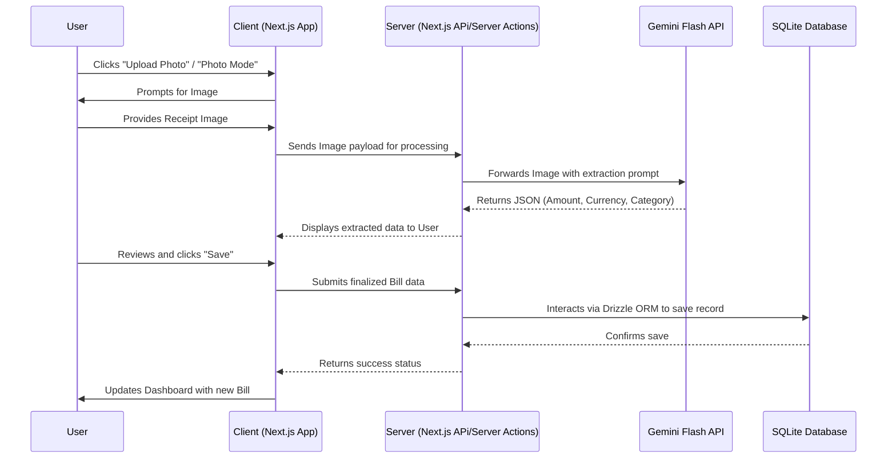
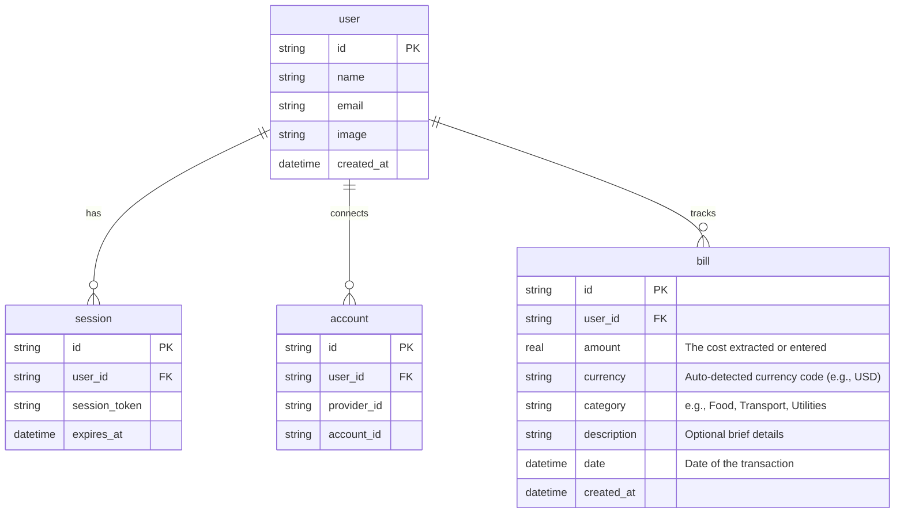

# PRD — Project Requirements Document

## 1. Overview
Managing daily expenses and keeping track of bills is often a tedious and manual process. People collect paper receipts or digital invoices but struggle to organize them efficiently due to the time required to log every purchase. This application aims to solve this problem by providing a dead-simple, highly minimalist bill tracker. By deeply integrating AI (specifically the Gemini Flash model), the app allows users to simply snap a photo or upload an image of a receipt. The AI will instantly extract the relevant data, drastically reducing manual data entry, all wrapped in a sleek, monochrome, distraction-free interface.

## 2. Requirements
- **Minimalist Design Language:** The application must strictly use a white-dominant theme (or a pure black dark mode) with virtually no accent colors to ensure a clean, distraction-free user experience. 
- **AI-Powered Extraction:** The app must utilize the Gemini Flash LLM to accurately read and extract totals, currencies (auto-detected), and item descriptions from uploaded or snapped photos of bills. The app owner covers the LLM API costs.
- **Simplified Data Entry:** The bill entry screen is restricted to exactly three clear actions: "Manual Entry", "Photo Mode" (using the device camera), and "Upload Photo".
- **Secure Access:** Users must be able to log in securely with their Google accounts using OAuth.
- **Categorization:** All expenses must be sortable into predefined categories: Food, Transport, Shopping, Utilities, Health, Entertainment, Household, Bills, and Other.
- **Portability:** Users must have the option to export their tracked data as a CSV file.
- **Self-Hosted:** The entire application must be deployable to a standard VPS (Virtual Private Server).

## 3. Core Features
- **Google OAuth Authentication:** Frictionless sign-up and sign-in using Google accounts.
- **Smart Bill Scanner:** Integration with Gemini Flash to process images and automatically extract the billing amount, date, and auto-detect the currency.
- **Three-Button Entry Interface:** A straightforward data entry page featuring only: manual text entry, live camera capture, or image file upload.
- **Minimalist Dashboard:** A clean overview screen displaying total tracked expenses and a chronological list of past bills.
- **Auto-Categorization:** AI attempts to automatically assign the scanned receipt into one of the 9 predefined categories.
- **CSV Data Export:** A single-click feature allowing users to download their financial records into a spreadsheet.
- **Dark/Light Mode:** A strict monochrome UI toggle supported by shadcn elements.

## 4. User Flow
1. **Authentication:** The user lands on the app and logs in securely using their Google account.
2. **Dashboard View:** The user is greeted by a minimalist, text-focused dashboard showing their total expenses and a scrollable list of recent bills.
3. **Adding a Bill:** The user clicks "Add Bill" and is presented with three simple buttons: *Manual*, *Photo Mode*, or *Upload Photo*.
4. **Data Capture:** 
   - If *Photo Mode/Upload* is selected, the user captures/selects an image. The application sends the image to the Gemini Flash AI.
   - The AI returns the extracted total, auto-detected currency, and suggested category.
   - If *Manual* is selected, the user types this information themselves.
5. **Review & Save:** The user reviews the extracted information on a simple form, makes any necessary tweaks, and clicks "Save".
6. **Update & Export:** The new bill instantly appears on the dashboard. At any point, the user can click an "Export CSV" button to download their data.

## 5. Architecture

## 6. Database Schema

The database utilizes SQLite and relies on core tables for authentication (provided by Better Auth) and an operational table for storing the bill metrics.

### Tables
- **`user`**: Stores authenticated user profiles.
- **`session`**: Manages active login sessions (managed by Better Auth).
- **`account`**: Stores Google OAuth linking configurations (managed by Better Auth).
- **`bill`**: Stores the actual expense items logged by the user.

## 7. Tech Stack
- **Frontend Layer:** Next.js (App Router), Tailwind CSS
- **UI Components:** shadcn/ui (Tailored for strict monochrome/minimalist guidelines)
- **Backend Layer:** Next.js Server Actions / API Routes
- **Database:** SQLite
- **ORM:** Drizzle ORM
- **Authentication:** Better Auth (Configured strictly for Google OAuth)
- **AI Integration:** Google Gen AI SDK (using `gemini-1.5-flash` model for high speed and low cost)
- **Deployment:** VPS (e.g., DigitalOcean, Hetzner, or AWS EC2 running Node/PM2 or Docker)
